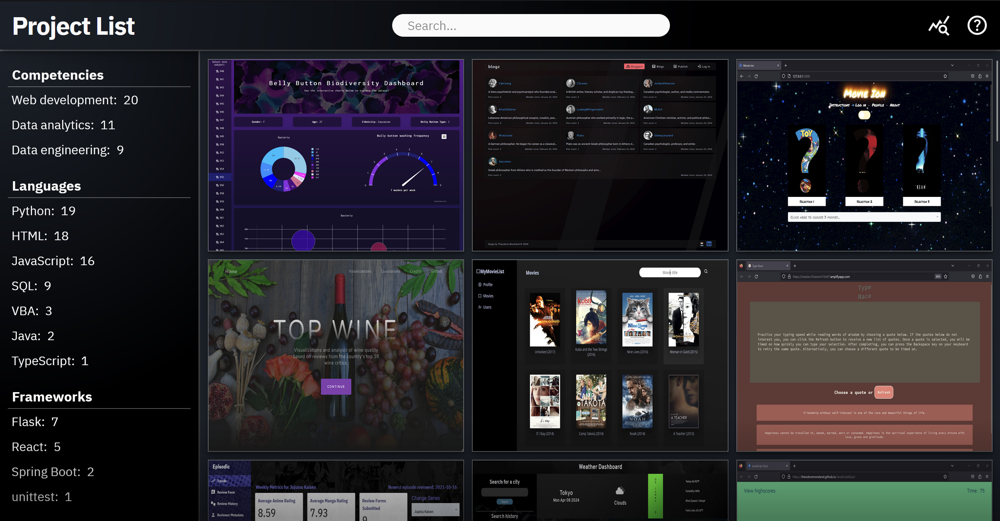

# Project List

An alternative view of my public GitHub repositories. Repository previews are generated dynamically via GitHub API. Word-clouds are used as a filtering interface such that said interface doubles as a filtering mechanism and a metric of technologies and/or competencies demonstrated throughout my GitHub profile.

[View the application live](https://main.d2wyze0voo0sc5.amplifyapp.com/)

_This project was originally my portfolio website in 2020. Its source code lived in a separate repository. As my skills and interests have outgrown this rendition, I decided to redo the source code repository and migrate the original version to this repository._

## Table of contents

- [Technologies Used](#technologies-used)
- [Screenshots](#screenshots)
  - [Desktop](#desktop-ultra-wide)
  - [Mobile](#mobile)

### Technologies Used

- React.js
- JavaScript (ES6)
- HTML5
- CSS3
- Bootstrap (via react-bootstrap)
- react-wordcloud
- react-markdown
- AWS

# Screenshots

## Desktop (Ultra-wide)

### Title Card

### Default view

### View with word-cloud filter open

### View with README open

### View when mouse hovers over thumbnail

### View after scrolling

## Mobile

### View

### View after scrolling

### View with README open

### View with mobile filter open

